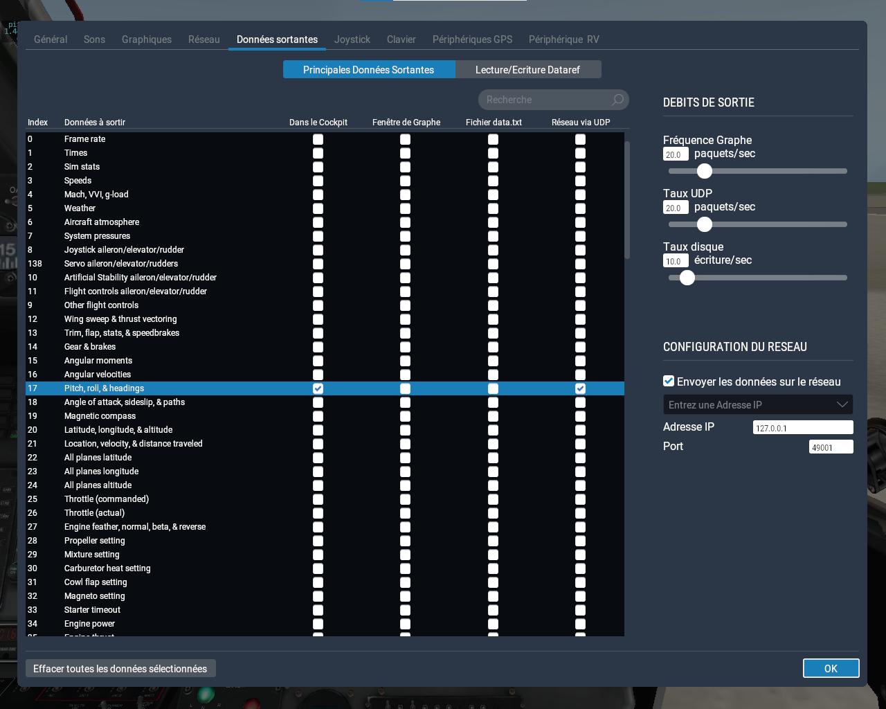
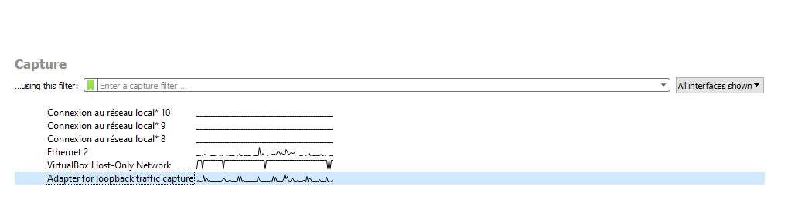
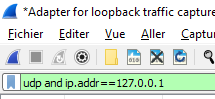
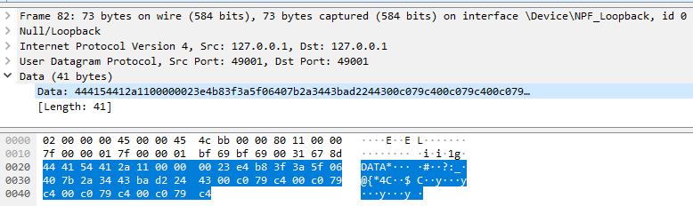
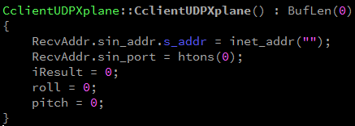
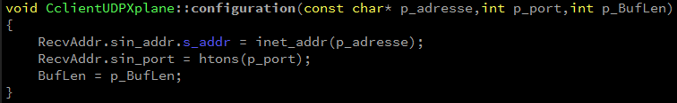
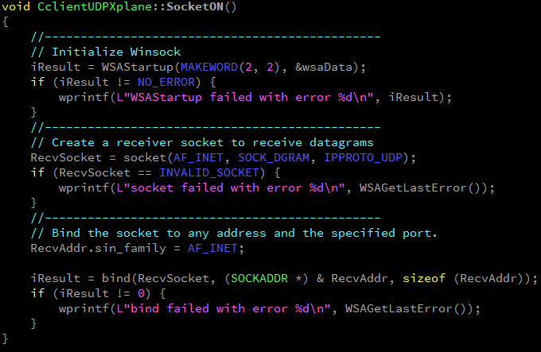
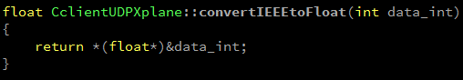
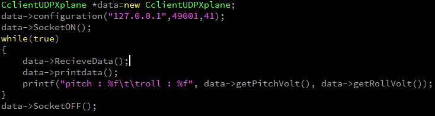

# Simulateur de Vol
Project scolaire, creation d'un simulateur de vol/XPlane/OculusRift

### Liste du matériel

-	PC
-	Joystick
-	Oculus rift
-	Carte d’acquisition National Instruments – NI USB-6211
-	Maquette d’avion avec moteurs

### Liste logiciels
-	Qt Creator
-    Ni MAX
-    Wireshark
-    DB Browser for SQLite

### Diagrame de cas d'utilisation

     
     
### Diagramme de déploiement

## Presentation scénario 1

Pour communiquer, lors de son lancement, le jeu créé un serveur udp. Il faudrat donc commencer par comprendre les données envoyer par le serveur et récupérer le "pitch" et le "roll"(tangage et roulis).

### 1. Relever de trame Wireshark

Pour relever les valeur de pitch et de roll (tanguage et rouli) envoyer par le serveur udp de xplane il faut :
lancer le jeu puis lancer une nouvelle partie puis apuyer sur échap, un menu vas s'ouvrir en haut de l'écran aller dans les paramètre en apuyant sur le bouton suivant

ensuite dans le menu Donnée sortante coché les cases "dans le cockpit" et "réseau UDP" à la ligne 17 (pitch roll and hidding) puis cocher la case "Envoyer les données sur le réseau" à droite dans configutration du réseau ensuite entrer en adresse ip : 127.0.0.1  et en port 49001.

Ensuite lancer une capture wireshark et relever sur Adaptater loopback trafic capture.

En filtre mettre : udp and ip.addr==127.0.0.1 pour filtrer les trame udp qui nous intéresse.

on à donc maintenant un relever de trame qu'il va faloir interpréter pour resortir le pitch et le roll que nous voulons.

Pour le trouver il va faloir prendre le 17ème octet de notre trame, dans ce cas "40" puis lire de droite a gauche les 4 premier octet en partant donc du 17ème soit dans ce cas 40 06 5f 3a qui nous donnera le roll puis les 4 suivants toujours de droite à gauche soit dans ce cas 3f b8 e4 23 qui nous donnera le pitch. Après avoir relever ces deux valeur en hexa il va faloir les convertir en float pour trouvé la valeur en degré.

### 2. Client UDP

Ensuite il nous faut créer le client udp nous permettant de recevoir les données du serveur du jeu.

Pour cela nous commençons par créer un objet :

RecvAddr.sin_addr.s_addr = inet_addr("");
RecvAddr.sin_port = htons(0);

Ces deux ligne nous permettent de choisir l'adresse ip et le port du serveur pour que le client puisse s'y connecté, BufLen est la taille du buffer.
Nous avons choisi de ne pas mettre les valeur d'ip et de port directement dans l'objet mais de faire une méthode configuration pour les changer.

Ensuite viennent les méthode de connection et déconnection au socket.

Nous arrivons donc maintenant à nous connecté au serveur udp du jeu, il nous faut donc maintenant recevoir les données que nous souhaitons ( pitch and roll ). Pour ce faire nous avons fait une méthode datarecive :Les data sont recue en chaîne de caractère et sont stocké dans un tableau puis sont convertient en float grâce a l'appel de la méthode de convertion suivante :

Dans notre main notre code vas donc se présenter comme ci-dessous.

Nous créons un objet data puis le configurons à l'adresse 127.0.0.1, sur le port 49001, et avec une taille de buffer de 41. Nous nous connectons au socket puis entamons une boucle infini "While(true)" dans laquelle nous recevons les données du serveur et de les afficher dans la console.

## Projets C++

